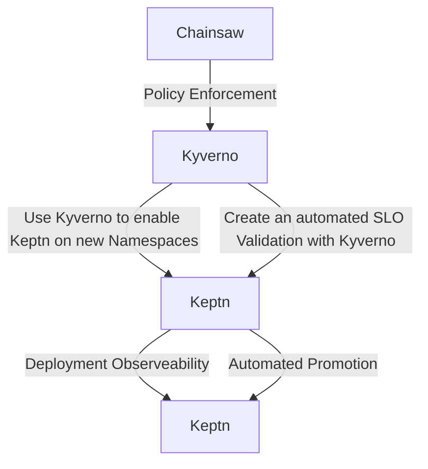

# Use Cases covered by this Workshop

## Chainsaw:

## Kyverno: Policy Enforcement

## Extend Keptn with Kyverno

### Use Case: Use Kyverno to enable Keptn on new Namespaces

### Use Case: Create an automated SLO Validation with Kyverno

## Keptn: Deployment Observeability

## Keptn: Automated Promotion

# Demo Environment

## Prerequisites
- GitHub Account

## Used Tools
- GitHub Codespaces
- KinD (Kubernetes in Docker)
- ArgoCD (Delivery)
- Chainsaw
- Kyberno 
- Keptn
- Grafana (Dashboarding)
- Jaeger (Observability)
- Prometheus (Observability)
- OpenTelemetry Collector (Observability)